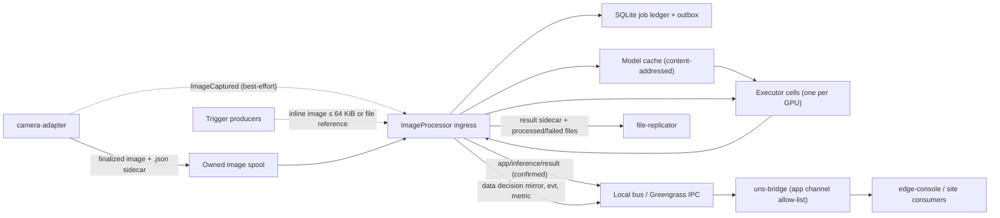
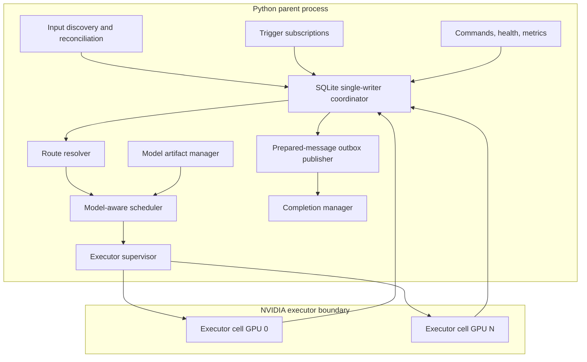
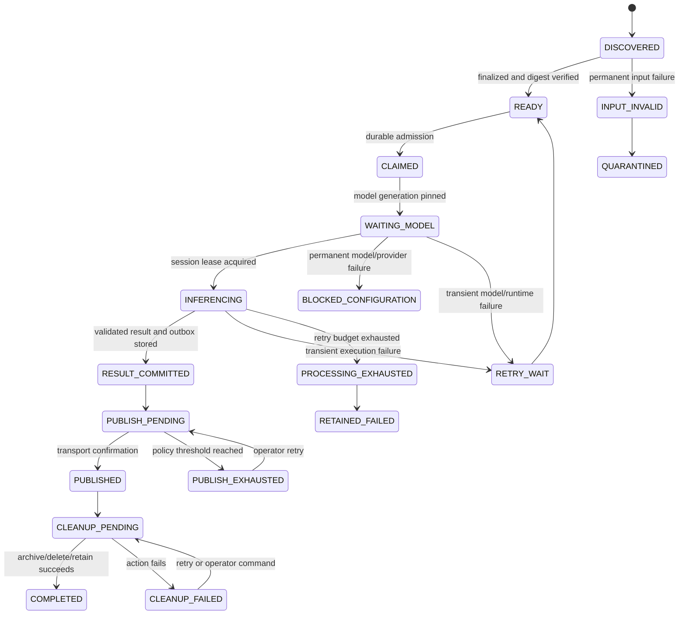

# DESIGN — ImageProcessor

> This document is the design-fidelity contract for this component. Before changing behavior,
> update the relevant section here in the same change. A build that compiles but drifts from what
> this document says is not done.

**Status:** accepted design, implementation starting 2026-08-22.
**Lineage:** `roadmap/image-inference-processor-hld.md` (initial HLD, 2026-07-27), adversarially
reviewed against the code on `main` of every sibling repo on 2026-08-22; the 16 decisions in §2
supersede the HLD's §21 open questions. Roadmap lineage: Phase D "CVML edge vertical" in
`roadmap/edgecommons-buildout-nextsteps.md`.

## 1. Identity

| Field | Value |
|---|---|
| Registry token / repo | `image-processor` (`edgecommons/image-processor`) |
| Greengrass component name | `com.mbreissi.edgecommons.ImageProcessor` |
| UNS `{component}` segment | `image-processor` (`component.token`) |
| Category | `processor` |
| Language / runtime | Python 3.12+, ONNX Runtime; NVIDIA CUDA execution provider |
| Platforms | `HOST`, `GREENGRASS`, `KUBERNETES` |
| Core library | `edgecommons` Python, pinned by git revision (`pyproject.toml`, `requirements.txt`) |
| Scope | Image models only. One component process hosts many routes; a route binds one input source to one immutable model version. |

## 2. Decision register

Decisions are binding until renegotiated with the user. "Verified" facts are the code facts the
decision rests on, checked on 2026-08-22.

| # | Decision | Rationale / verified facts |
|---|---|---|
| D-IP-1 | **Input sources:** (a) finalized image files in an owned spool; (b) a subscription trigger — a message on a configured topic whose body carries either an inline binary image or a file reference. Image models only. | The file spool is the camera-adapter integration; the trigger serves producers that already hold the image or its path. Non-image model serving is out of scope. |
| D-IP-2 | **Name** `image-processor` / `ImageProcessor`, category `processor`. | Registry `category` enum includes `processor` (used by `telemetry-processor`); flat kebab repo name per org `CONTRIBUTING.md`. |
| D-IP-3 | **Python + ONNX Runtime.** The parent process is the control and durability plane; GPU work runs in supervised executor subprocesses. | Roadmap-locked "Python inference component". Verified: the Python core ships `app().prepare()` / `publish_confirmed()`, all three platforms, candidate config validators. |
| D-IP-4 | **Scaffolded with `edgecommons component new --kind processor`;** template gaps are fixed in core, not patched locally. | Dogfooding. The python-processor template lacked `pyproject.toml`/`requirements-test.txt` and used a literal `app/` package → core PR #100 (DEF-17). |
| D-IP-5 | **Inline trigger images are bounded by the core envelope's 64 KiB binary-body cap.** Larger images arrive by file reference. | `MAX_BINARY_BODY_BYTES = 64 KiB`, enforced on encode and decode in all four languages; raising it is a wire-contract change and is not taken. |
| D-IP-6 | **The rich result on `app/inference/result` is the only authoritative, cleanup-gating output.** Normalized `data/<signal>` decision signals are a best-effort mirror. Safety consumers subscribe to the `app` result. | Verified: `AppFacade.prepare()` freezes exact bytes; `publish_confirmed()` pins QoS 1 and waits for PUBACK / IPC completion; `data()` has no confirmed variant and swallows northbound errors. |
| D-IP-7 | **Site delivery:** uns-bridge gains a channel allow-list for the `app` class (`classes.app.channels`, e.g. `["inference/#"]`). Required for the site/edge-console leg, not for Phase 1. | Verified: uns-bridge `app` is a class-wide boolean (default off) subscribing both full wildcards; only `evt` is buffered through a site-link outage; uplink QoS 1. |
| D-IP-8 | **Topology:** process-first in Phase 1 (ImageProcessor owns the camera spool copy); evidence-first becomes the regulated default in Phase 4 after file-replicator gains pair-aware handoff, a bundle manifest, and a receipt. | Verified: camera-adapter never mutates its output; file-replicator has no image+sidecar pairing, no manifest, no receipt, and records archive/delete failure as `Completed`. |
| D-IP-9 | **Model delivery v1 is component-owned:** `models[]` in config names `{id, version, digest, uri}`; the component pulls from `s3://`, `https://`, or a local path into its content-addressed cache. Deployment Studio asset rendering is a separate later change. | Verified: `topologyComponent.files` is parsed but no HOST/Greengrass/Kubernetes renderer stages it; no digest/signature/GPU/volume concepts exist in `ec-deploy`. |
| D-IP-10 | **Signing:** Ed25519 detached signature over `manifest.json`; trusted public keys configured by `keyId`. Digest verification is always on; signature verification is required by the regulated profile. | Offline-friendly, no PKI or registry dependency, small verification surface. |
| D-IP-11 | **Bundle format:** a tarball (optionally gzip) with `manifest.json` at the root; the bundle digest is the SHA-256 of the tarball; extraction enforces path, count, size, and ratio limits. | One object per bundle for any transport; digest is transport-independent. |
| D-IP-12 | **Processing is declarative:** built-in task families (classification, detection with NMS, segmentation, anomaly score) plus JSONPath decision rules over the normalized task output. A model whose head no task family can interpret is refused at staging. No bundle-supplied code. | Keeps the executor free of a code-execution trust surface in v1. |
| D-IP-13 | **GPU validation hardware:** the desktop RTX 5080 (WSL2) for HOST development, and `lab-5950x` (RTX 2080 Super) for the HOST and GREENGRASS gates. | Both available. Turing (sm_75) and Blackwell (sm_120) together cover the provider/driver matrix. |
| D-IP-14 | **CI:** the full suite runs on `CPUExecutionProvider` in GitHub CI; a marked NVIDIA suite runs on lab hardware and is a release gate. | GitHub-hosted runners have no GPU. |
| D-IP-15 | **Execution providers:** CUDA EP only in Phase 1. TensorRT EP is per-model opt-in in Phase 2, with engine/timing caches, a bounded engine-build scheduler, and "CUDA until the engine is ready". | Engines are GPU-class/driver/TensorRT-version specific and cost minutes per model; hundreds of models make unscheduled builds unbounded. |
| D-IP-16 | **Trims and cross-repo fixes:** the Triton benchmark is dropped from Phase 0. file-replicator's archive/delete-failure-as-success is fixed in a separate Rust PR. | ONNX Runtime is the accepted runtime. An evidence pipeline cannot report success on a failed move. |
| D-IP-17 | **Test corpus in four tiers** (§16): synthetic known-answer ONNX graphs and generated images in CI; permissively licensed real models (MobileNetV2, ResNet-50, YOLOX-Nano/S, SSD-MobileNetV1, DeepLabV3-MobileNetV3, anomalib PatchCore on VisA `capsules`) with Imagenette, a COCO val2017 slice, and VisA; a synthesized multi-bundle corpus for residency tests; camera-sim E2E. YOLOv8/YOLO11 (AGPL-3.0) and MVTec AD (CC BY-NC) are excluded. | Known answers make the CI suite deterministic and network-free; the real-model tier proves decode/pre/post chains; residency needs more bundles than fit in 8 GB, which real models cannot supply. License terms must be compatible with a BUSL product even for test use. |
| D-IP-18 | **camera-adapter's `sim` backend gains a `playlist` pattern** that replays a directory of real images as captures with genuine sidecars and announcements. | The sim's synthetic patterns prove plumbing only; a true line-clearance E2E in the Dallas harness needs real imagery through the real camera path. Reusable by any future vision component. |
| D-IP-19 | **The real-model tier runs nightly and on demand**, not per PR; golden results are committed as small JSON files; images and models are never committed (pinned-URL + SHA-256 asset manifest, cached under `tests/.cache/`). | Keeps per-PR CI fast and repository size bounded while still asserting parity against real models. |

Residual facts verified on 2026-08-22 that shape the design: the Python core exposes candidate
validators (validate-then-apply, reject-and-keep) and a post-apply listener but no prepared
commit/rollback transaction (Rust has one); `$secret` references are auto-resolved only under
`streaming`, so this component resolves its own; the core has no artifact fetcher; the registry
schema has no GPU/capability field; the built-in command verbs are `ping`, `describe`,
`reload-config`, `get-configuration`, `status`; deferred replies are bounded to 31 minutes.

## 3. System context



The image is the data plane; the bus carries discovery hints, bounded results, status, metrics, and
control. The component never publishes a full frame.

## 4. Input sources

### 4.1 File spool

Filesystem state is authoritative. OS notifications coalesce into scan nudges; a periodic
deterministic rescan recovers missed events; only regular files under the configured root are
accepted; symlinks and path escapes are rejected; include/exclude patterns apply to normalized
relative paths.

Readiness is source-specific:

| `readiness.mode` | Rule |
|---|---|
| `cameraSidecar` | The camera metadata sidecar `<image>.json` exists and parses; its `image.bytes` and `image.sha256` match the file. camera-adapter writes the sidecar before the image becomes visible, so a visible image with a sidecar is complete by construction. Regulated routes require this mode. |
| `cameraStatus` | A `SUCCEEDED` record from the camera's paged `sb/capture-status` whose file/digest verifies. Reconciliation follows every `nextCursor`, deduplicates by `captureId`, and records its watermark. Sizing accounts for the camera's `state.resultRetentionHours` (72) and `state.maxResultRecords` (100,000). |
| `marker` | A companion file `<path><suffix>` exists. |
| `stability` | Size and mtime unchanged for `quietSecs`. Not permitted on camera-bound routes. |

A camera-bound route additionally consumes `ecv1/{device}/camera-adapter/{instance}/app/image/captured`
as a low-latency hint: the processor maps `image.relativePath` under its configured root, never
trusts `image.absolutePath`, and verifies `image.bytes` and `image.sha256` against the file. The hint
is not a queue; a lost hint cannot lose a job.

### 4.2 Subscription trigger

A trigger route subscribes to a configured topic filter. The message body is one of:

| Body | Handling |
|---|---|
| Inline image: an opaque binary body, or a structured body with an `image` field of type `bytes` | Bounded by the core 64 KiB binary-body cap. The bytes are written to processor-owned staging under a deterministic name, hashed, and from then on follow the file path. |
| File reference: `{ "relativePath": "...", "sha256": "...", "bytes": n }` | `relativePath` is resolved under the route's configured root (path containment enforced); `sha256` and `bytes` are verified against the file before admission. |

A trigger message carries request correlation: when the envelope has `reply_to`, the route
publishes the bounded result summary as the correlated reply in addition to the normal outputs.

### 4.3 Job identity

Preferred logical key: `routeId + captureId + modelDigest`. Fallback: `routeId +
normalizedSourceId + sourceSha256 + modelDigest`. `inferenceId` is derived or persisted once from
that key; retries reuse it; reprocessing under a new model digest is a new inference. A model
activation does not replay terminal inputs unless `reprocessExistingOnModelChange` (default `false`)
is set or an operator command requests it.

## 5. File ownership topology

Exactly one component may mutate a given spool.

### 5.1 Process-first (Phase 1 default)

```text
camera-adapter output spool
  └─ ImageProcessor owns the spool: infer, then archive / quarantine / retain / delete
       ├─ processed/<route>/...   ← file-replicator route (evidence)
       └─ failed/<route>/...      ← file-replicator route (evidence)
```

camera-adapter never deletes or moves its output, so ownership is unambiguous. A backlog delays
remote evidence delivery; the route's queue-age threshold raises an `evt` condition.

### 5.2 Evidence-first (Phase 4 regulated default)

```text
camera-adapter output spool
  └─ file-replicator owns the spool
       ├─ immutable remote evidence destination
       └─ verified local ImageProcessor inbox (image + sidecar delivered as a pair)
            └─ ImageProcessor owns the inbox copy
```

Prerequisites in file-replicator: pair-aware delivery of `<image>` and `<image>.json`, an atomic
handoff manifest, a replication receipt carrying destination URI and checksum, and archive/delete
failure recorded as a retryable failure (D-IP-16).

### 5.3 Unsupported

ImageProcessor and file-replicator must never both configure a mutating action against the same
root. The component's own validation rejects overlapping mutating roots among its routes; the
cross-component check is a Deployment Studio gap.

## 6. Component architecture



### 6.1 Parent process

Owns EdgeCommons integration and all durable coordination: platform/config/identity; filesystem
watch, rescan, camera hint and status reconciliation; trigger subscriptions; route and model
resolution; the SQLite ledger, outbox, and operations; model download, verification, and cache
metadata; admission, fairness, and executor selection; result schema validation, sidecar
generation, and exact message preparation; completion actions and recovery; commands, metrics,
events, health, readiness. The parent never initializes CUDA and never decodes pixels.

### 6.2 Executor cells

One supervised subprocess per GPU, owning one CUDA context and a cache of ONNX Runtime sessions.
The parent sends a job descriptor: the staged input path, expected digest, model digest, and
transform version. The cell reads the immutable staged file itself, verifies the digest, decodes
and preprocesses on CPU (GPU decode is a later, profiled option), runs the session with I/O binding
where lifetimes permit, applies the task family's postprocessing, and returns a bounded typed
result plus memory high-water and timing data. Cells single-flight concurrent loads of the same
model generation and perform golden warmup before a session serves jobs.

A CUDA error classified as process-contaminating drains and restarts the cell. Jobs that did not
commit a result return to retry with the same `inferenceId` and pinned model digest. One cell per
GPU means a restart evicts every resident model on that GPU; executor recycle count and
post-restart reload time are release-gate metrics.

## 7. Durable job lifecycle



SQLite runs in WAL mode behind a single-writer coordinator; the regulated profile uses
`synchronous=FULL`. A job is accepted only after its admission transaction commits; admission
reserves outbox and evidence capacity for the maximum configured result so a finished job is never
stranded by a full outbox.

The durable record holds input identity and readiness evidence, capture provenance, route
configuration generation, the exact model id/version/digest/provider policy/transform version,
retry state, the result or result-sidecar digest, the prepared topic and envelope bytes, the
publication acknowledgement, and the intended and observed completion action.

Result-sidecar installation and the SQLite commit follow one ordered protocol: write the sidecar to
a unique temporary file; flush according to the durability profile; atomically install it at its
deterministic path and fsync the directory where supported; in one transaction commit the result,
every cleanup-gating outbox row, the sidecar digest, and `RESULT_COMMITTED`; only then make the
outbox eligible. Recovery reconciles the filesystem and database before publishing: an orphan
sidecar is verified and adopted or removed; a committed record whose sidecar is absent returns to
re-inference.

Confirmed publish is positive transport acceptance — MQTT PUBACK at QoS 1, or completion of the
Greengrass IPC publish operation — through `AppFacade.publish_confirmed()` with the stored bytes.
A crash between transport confirmation and the local acknowledgement commit may publish a
duplicate; consumers deduplicate on `inferenceId`.

Before any archive/delete/retain/quarantine mutation the ledger stores a cleanup intent (action,
deterministic target, source digest, bundle members). Recovery evaluates observed state: source
present and target absent retries; source absent and target present with matching digest completes;
both present after a cross-filesystem copy verifies then removes the source; a target with a
different digest is a collision failure; a source absent after a delete intent completes only when
the intent proves the intended object was removed. Multi-file moves install a bundle manifest last.
Cleanup failure is `CLEANUP_FAILED`: retried by policy, repairable by command, never success.

## 8. Model bundle contract

A bundle is an immutable, content-addressed tarball (D-IP-11):

```text
<modelId>-<version>.tar[.gz]
  manifest.json
  manifest.sig            Ed25519 detached signature over manifest.json (D-IP-10)
  model.onnx
  labels.json
  transforms.json
  result.schema.json
  model-card.json
  warmup/input-01.bin, warmup/expected-01.json
  engines/<compatibility-key>/engine.plan   (Phase 2, optional)
```

`manifest.json` declares: schema version, model id, semantic version, per-file SHA-256 digests,
minimum ONNX Runtime version, permitted execution providers and required provider policy, input
and output names/types/shapes/dynamic dimensions (including whether a dynamic batch axis exists),
the task family and its parameters, decode/preprocessing configuration, the decision rules, the
typed result schema and maximum result cardinality, estimated device memory and optional measured
profiles per GPU class, warmup samples and tolerances, compatibility keys for engine caches,
provenance and publisher identity, and the signing `keyId`.

### 8.1 Task families and decision rules (D-IP-12)

| Family | Normalized output |
|---|---|
| `classification` | `classes[]` of `{label, index, score}`, top-k and softmax/sigmoid options |
| `detection` | `detections[]` of `{label, score, box{x,y,w,h}}` after NMS; anchor/grid decoding parameters in the manifest |
| `segmentation` | per-class pixel counts and bounding regions; masks are never published on the bus |
| `anomaly` | `score`, `threshold`, optional heatmap summary |

Decision rules are JSONPath expressions over the normalized output producing `decision.outcome`,
`decision.pass`, `decision.confidence`, and `decision.threshold`; a rule that cannot evaluate yields
`HOLD`, never `CLEAR`.

## 9. Model delivery and activation

Configuration names the desired model set; the component makes it active (D-IP-9):

1. Observe a desired `models[]` entry or an explicit `preload-model` command.
2. Download or copy the tarball into a unique staging directory (`s3://` via the configured
   credentials or ambient/TES credentials, `https://` with TLS verification and allow-listed
   prefixes, or a local path).
3. Verify the tarball digest, then the signature when required, then extract with path, count,
   size, and ratio limits, then verify per-file digests and the manifest schema.
4. Validate provider compatibility and task-family support; refuse otherwise.
5. Run golden warmup on the target provider.
6. Atomically promote the bundle into the content-addressed cache and mark it `STAGED`.
7. Switch the route's active generation atomically; in-flight jobs keep their pinned generation;
   the last-known-good bundle is retained for rollback.

The component persists and reports `desiredGeneration` and `activeGeneration` per route. When the
core configuration snapshot is ahead of the active generation, the route reports `STAGING` and
stays on the last-known-good model. Disk garbage collection never removes the active generation,
an in-flight pinned generation, the rollback generation, or a bundle referenced by a pending job.

The component is the single reader of its `$secret` references (model source credentials, signing
keys) and resolves them through `gg.get_credentials()`; the core resolves `$secret` only under
`streaming`.

## 10. NVIDIA execution

### 10.1 Provider profile

Phase 1: `CUDAExecutionProvider`, fail if the route's provider policy is not satisfied. No silent
CPU fallback; `allowCpuOnly` is a development-only setting. The CI parity suite runs the identical
pipeline on `CPUExecutionProvider` (D-IP-14).

Phase 2 (D-IP-15): `TensorrtExecutionProvider` before CUDA for models whose manifest opts in,
with engine and timing caches keyed by the full compatibility key, a bounded engine-build scheduler
(never on a live request), and CUDA execution until the engine is ready. The component records the
actual provider assignment on every result.

### 10.2 Residency and admission

Cache tiers: resident GPU sessions (L0), host page cache of memory-mapped model files (L1), the
local content-addressed bundle cache (L2), the remote source (L3). Residency is keyed by model
digest plus provider/options, precision, shape profile, and GPU class, not by route; routes bound to
the same generation share one session.

GPU admission uses the manifest estimate, previously measured load peak and steady-state delta
(NVML), current device free memory, a runtime safety reserve, the expected activation peak, and a
co-located process allowance. ONNX Runtime's `gpu_mem_limit` bounds only the provider arena. Load
concurrency defaults to one per GPU; leases pin sessions used by queued or in-flight work.

### 10.3 Scheduling

Per-model-generation lanes: resident-model work is preferred; a newly loaded model drains a bounded
burst and stays resident for a minimum residency; same-model compatible-shape jobs micro-batch
within `maxBatchSize`/`maxBatchLatencyMs` only when the manifest declares a dynamic batch axis;
weighted age and route priority prevent starvation; a camera hint may start a load while the digest
completes; concurrent cold requests share one load. Eviction is cost-aware (queued work, predicted
reuse, measured reload cost, size, priority, recency); idle sessions are evicted lowest value per
byte first. Thrash is measured and reported; accepted jobs are never dropped.

### 10.4 Unload and recycle

Normal unload stops new leases, drains, releases the session and buffers, synchronizes, and samples
memory after a settle period. If memory is not reclaimed, fragmentation crosses the threshold, or
the runtime reports a sticky failure, the supervisor drains and restarts the cell.

## 11. Configuration shape

Illustrative; `config.schema.json` is the contract.

```jsonc
{
  "component": {
    "token": "image-processor",
    "global": {
      "paths": {
        "stateDb": "/var/lib/edgecommons/image-processor/state.db",
        "modelCache": "/var/lib/edgecommons/image-processor/models",
        "staging": "/var/lib/edgecommons/image-processor/staging"
      },
      "runtime": {
        "providers": ["CUDAExecutionProvider"],
        "requiredProvider": "CUDAExecutionProvider",
        "allowCpuOnly": false,
        "executorCellsPerGpu": 1,
        "loadConcurrencyPerGpu": 1
      },
      "gpu": { "devices": ["0"], "residentMemoryBudgetPercent": 80, "reserveMiB": 2048 },
      "scheduler": { "maxBatchLatencyMs": 20, "hotTtlSecs": 120, "minResidencySecs": 15 },
      "publish": { "confirmationTimeoutSecs": 10, "requireConfirmationBeforeCleanup": true },
      "signing": {
        "required": true,
        "trustedKeys": [ { "keyId": "pharma-model-publisher-1", "publicKey": { "$secret": "model-signing/publisher-1" } } ]
      },
      "models": [
        {
          "id": "line-clearance-cam-01",
          "version": "2026.08.20",
          "digest": "sha256:<tarball-digest>",
          "uri": "s3://approved-models/line-clearance-cam-01/2026.08.20.tar.gz",
          "credentials": { "$secret": "model-source/approved-models" },
          "activation": { "requireWarmup": true, "retainForRollback": true }
        }
      ],
      "completionDefaults": {
        "onSuccess": "archive", "onInvalidInput": "quarantine",
        "onOperationalFailure": "retainInPlace", "onPublishFailure": "retainInPlace", "onCollision": "fail"
      }
    },
    "instances": [
      {
        "id": "clearance-cam-01",
        "priority": 100,
        "source": {
          "kind": "spool",
          "root": "/var/spool/camera-adapter/cam-01",
          "include": ["**/*.jpg", "**/*.png", "**/*.tiff"],
          "readiness": { "mode": "cameraSidecar" },
          "camera": { "component": "camera-adapter", "instance": "cam-01", "subscribeAnnouncements": true, "reconcileCaptureStatusSecs": 30 }
        },
        "modelRef": { "id": "line-clearance-cam-01", "version": "2026.08.20", "digest": "sha256:<tarball-digest>" },
        "outputs": {
          "writeResultSidecar": true,
          "decisionSignals": [
            { "id": "line-clearance/pass", "value": "$.decision.pass" },
            { "id": "line-clearance/confidence", "value": "$.decision.confidence" },
            { "id": "line-clearance/status", "value": "$.status" }
          ]
        },
        "completion": { "onSuccess": "archive", "archiveDir": "/var/spool/image-processor/processed/cam-01", "failedDir": "/var/spool/image-processor/failed/cam-01" }
      },
      {
        "id": "adhoc-inspect",
        "source": {
          "kind": "trigger",
          "subscribe": ["ecv1/+/inspection-ui/+/app/inspect/request"],
          "fileRoot": "/var/spool/inspection",
          "inlineStaging": "/var/lib/edgecommons/image-processor/staging/adhoc"
        },
        "modelRef": { "id": "line-clearance-cam-01", "version": "2026.08.20", "digest": "sha256:<tarball-digest>" },
        "outputs": { "writeResultSidecar": false, "decisionSignals": [] },
        "completion": { "onSuccess": "delete" }
      }
    ]
  }
}
```

Validation is fail-closed: unknown fields, duplicate ids, unresolved model references, overlapping
mutating roots, missing completion directories, provider policy, path containment, trigger roots,
and output-schema mismatches reject the candidate (core candidate validator, reject-and-keep).
Configuration reload uses a component-local desired-versus-active generation reconciler: the core
snapshot may be ahead of the active generation, and the route reports that as `STAGING`.

## 12. Message contracts

### 12.1 Inference result (authoritative, D-IP-6)

Topic `ecv1/{device}/image-processor/{routeId}/app/inference/result`; header name
`ImageInferenceResult`, version `1.0`. Body (illustrative; `schemas/inference-result.schema.json`
is the contract):

```json
{
  "schemaVersion": "1.0",
  "inferenceId": "01K...",
  "status": "SUCCEEDED",
  "source": { "kind": "spool", "captureId": "01K...", "cameraId": "cam-01", "relativePath": "2026/08/22/....jpg", "bytes": 4182032, "sha256": "..." },
  "model": { "id": "line-clearance-cam-01", "version": "2026.08.20", "digest": "sha256:...", "runtime": "onnxruntime", "providers": ["CUDAExecutionProvider"], "gpu": { "deviceId": "0", "class": "..." } },
  "decision": { "outcome": "CLEAR", "pass": true, "confidence": 0.997, "threshold": 0.98 },
  "outputs": { "classes": [], "detections": [] },
  "timingsMs": { "queue": 12.4, "modelLoad": 0, "preprocess": 3.1, "inference": 5.8, "postprocess": 0.9, "total": 22.2 },
  "artifacts": { "evidenceId": "01K...", "localRelativePath": "cam-01/....inference.json", "sha256": "..." }
}
```

All collections have configured limits. A result over the message budget is written in full to the
result sidecar and published as a bounded summary with `evidenceId`, relative path, size, and
digest; a decision-bearing result is never truncated silently. Source `kind` is `spool`, `inline`,
or `reference`. The component prepares the message with `app().prepare()`, stores the exact topic
and bytes, and retries the same bytes with `publish_confirmed()`.

### 12.2 Decision mirror (best-effort)

Configured `decisionSignals` publish `SouthboundSignalUpdate` readings through the `data()` facade
on `ecv1/{device}/image-processor/{routeId}/data/<signalId>`. They are derived from the committed
result and are not cleanup-gating. A consumer enforcing a safety gate subscribes to
`app/inference/result`; any missing, failed, stale, or degraded inference is **not clear**.

### 12.3 Events and metrics

`evt` carries bounded operator conditions: model verification/warmup failure, required GPU
unavailable, route degraded or queue age exceeded, repeated executor recycle, publish backlog near
capacity, evidence or cleanup failure, disk or GPU pressure. Success is not an event.

Metric groups: `ImageProcessorDiscovery`, `ImageProcessorQueue`, `ImageProcessorModelCache`,
`ImageProcessorGpu`, `ImageProcessorInference`, `ImageProcessorOutbox`, `ImageProcessorCompletion`,
`ImageProcessorDisk`. File names, capture ids, and model versions are not metric dimensions.

### 12.4 Evidence sidecar

`<image>.inference.json` binds capture identity and timestamp, source path/size/digest, route and
configuration generation, model id/version/digest/provider policy/runtime versions, the full
result and timings, schema and transform versions, and `inferenceId`/`evidenceId`. It is immutable
once installed.

## 13. Commands

Built-in library verbs (`ping`, `describe`, `reload-config`, `get-configuration`, `status`) serve
liveness, panel descriptors, reload, configuration, and per-instance connectivity (the `status`
reply carries `state.instances[]`: route enabled, source reachable, model generation active or
staging, executor healthy).

Component verbs (`CommandInbox.register_outcome`, instance scope unless noted):

| Verb | Scope | Behavior |
|---|---|---|
| `get-models` | component | Staged/active/rollback generations per model id; paginated (`cursor`, `max`). |
| `get-queue` | both | Jobs by state and age; paginated. |
| `trigger-rescan` | both | Immediate authoritative rescan. |
| `preload-model` | component | Stage and warm a model digest; deferred reply with the outcome. |
| `evict-model` | component | Evict an idle session; refuses a leased model. |
| `reload-model-catalog` | component | Re-evaluate `models[]` against the cache. |
| `set-route-activation-override` | instance | Persisted operational override reported beside configured state; does not mutate configuration. |
| `retry-publication`, `retry-cleanup`, `reconcile` | both | Operator repair actions; deferred replies. |
| `pause`, `resume` | both | Stop/resume claiming new work; in-flight jobs finish. |

Long-running verbs use the core deferred reply (bounded to 31 minutes); an operation that can run
longer reports progress through `get-queue`/`get-models` and an `evt` on completion.

## 14. Health and readiness

Ready requires readable configuration with at least one valid active route, writable state/outbox
and required spool directories, verified model-cache metadata, at least one healthy executor when a
route requires NVIDIA, and broker/IPC state compatible with the configured backlog policy. A bad
model degrades its routes; the component fails when no required route can execute, the required
provider is unavailable, state durability is lost, or fail-safe backlog limits are exceeded.

## 15. Security

Digest verification always; signature verification by profile; no bundle-supplied code; approved
URI schemes, TLS verification, allow-listed prefixes, and `$secret` or ambient credentials for
downloads; archive extraction limits; image byte/pixel/dimension limits before allocation; input
roots reject traversal, symlink escape, device files, and output feedback loops; inference in
subprocesses under OS sandboxing, non-root, read-only root filesystem, least-privilege mounts where
supported; broker ACLs scoped to the component's `app`/`data`/`evt`/`cmd` topics; logs never carry
image bytes, tensors, credentials, or unbounded model output; a failed, missing, stale, or
unverified inference is `HOLD`.

## 16. Validation

### 16.1 Test tiers and corpus (D-IP-17, D-IP-19)

| Tier | Runs | Models | Images | Proves |
|---|---|---|---|---|
| 1 — CI suite | every PR, `CPUExecutionProvider`, no network, 90% line coverage | Synthetic ONNX graphs generated in-test with `onnx.helper`, fixed weights, one per task family: classification (conv → global pool → FC, class = dominant quadrant color), detection (fixed overlapping box set for decode + NMS), segmentation (threshold mask with derivable pixel counts), anomaly (mean-abs-diff against a baked reference). Deliberately bad bundles: unsupported head, wrong signature, tampered digest, oversized archive, path-traversal member, static vs dynamic batch axis. | Generated with Pillow/numpy: quadrant, gradient, and solid images with computable expected outputs; corrupt, truncated, zero-byte, decompression-bomb, wrong-extension, and 16-bit TIFF fixtures; camera-shaped fixtures (JPEG + `<image>.json` in the `ImageCaptured` body shape, written sidecar-first). Built by `tests/fixtures/build.py`; nothing binary is committed. | Task families, decision rules, lifecycle and kill-points, readiness modes, trigger path (inline ≤ 64 KiB and file reference), signing, outbox/confirm, completion and recovery. |
| 2 — real models | nightly and on demand (`EC_LIVE_MODELS=1`); CPU in CI, GPU on lab | MobileNetV2 and ResNet-50 (ONNX Model Zoo, Apache-2.0); YOLOX-Nano/S (Apache-2.0) and SSD-MobileNetV1 (MIT); DeepLabV3-MobileNetV3 (torchvision export, BSD-3); anomalib PatchCore (Apache-2.0) trained on VisA `capsules`. Packed into signed bundles by `tools/make-bundle.py`. | Imagenette (Apache-2.0); a ~200-image COCO val2017 slice (annotations CC BY 4.0, images test-only and uncommitted); VisA `capsules` good/bad splits (CC BY 4.0). Pinned by `tests/assets.json` (URL + SHA-256), cached under `tests/.cache/`. | Real decode/preprocess/postprocess chains; provider-assignment recording; CPU↔CUDA parity within tolerance against committed JSON goldens (top-k labels, box IoU ≥ 0.9, anomaly AUROC threshold). |
| 3 — residency and burst | GPU lab (RTX 5080 16 GB, RTX 2080 Super 8 GB), release gate (`EC_NVIDIA=1`) | Synthesized corpus: N distinct bundles from the MobileNetV2 and YOLOX-S architectures with perturbed weights and a padded initializer sizing them to ≈ 50 MB / 200 MB / 600 MB / 1.5 GB (for example 40 bundles, ≈ 20 GB against an 8 GB card). | Tier-2 corpora replayed at rate by the spool-writer fixture in camera format. | Cold load, warm inference, eviction, reload, recycle count, zero OOM, p50/p95/p99 queue and inference latency under uniform, Zipf-skewed, synchronized-burst, and scheduled-prefetch arrivals. These measurements set the Phase 0 SLOs. |
| 4 — E2E | HOST (local EMQX + Docker), GREENGRASS on `lab-5950x` over real IPC, KUBERNETES (kind runner VM or lab k3s), Dallas harness | Per-camera line-clearance bundles: the VisA-capsules PatchCore anomaly model and a synthetic line-clearance classifier trained on procedurally rendered tray/conveyor scenes with and without foreign objects; each camera instance binds a distinct digest. | camera-adapter `sim` with the `playlist` pattern (D-IP-18) replaying VisA and the rendered scenes through the real camera path (sidecars, announcements). | Process-first topology end to end: readiness, hints, confirmed publish, archive/quarantine, evidence files, file-replicator replication, uns-bridge relay, edge-console; Greengrass and Kubernetes NVIDIA deployment. |

### 16.2 Gates

| Gate | Where |
|---|---|
| Tier 1 suite, 90% line coverage | GitHub CI (`ci.yml`), every PR |
| Kill-point tests after every durable transition; corrupt/oversized input and bundle tests; lost/duplicate hint and status-reconciliation tests; broker outage, outbox saturation, duplicate-publish tests; stage/activate/rollback, bad signature, last-known-good tests | GitHub CI (tier 1) |
| Tier 2 real-model parity | GitHub CI nightly/on demand (CPU); lab GPU |
| Tier 3 NVIDIA residency and burst | Desktop RTX 5080 (WSL2) and `lab-5950x` RTX 2080 Super; release gate |
| Tier 4 HOST E2E, GREENGRASS deployed regression, KUBERNETES, full-system UNS E2E | Local EMQX + Docker; `lab-5950x`; kind/k3s; `bottling-company-test` |

## 17. Delivery phases

| Phase | Content |
|---|---|
| 0 — contracts | Freeze `schemas/inference-result.schema.json`, the bundle manifest schema, `config.schema.json`; representative model corpus for both GPUs; numeric SLOs from measurement. |
| 1 — HOST vertical slice | Spool and trigger sources; SQLite ledger, outbox, completion; one GPU, CUDA EP, single then multi-model residency; result, decision mirror, sidecar, metrics, health, commands; camera hint/status reconciliation; local camera-adapter/file-replicator E2E. |
| 2 — model lifecycle and burst scale | Source providers and signatures; pre-stage/activate/rollback; TensorRT opt-in with engine caches and build scheduler; cost-aware multi-GPU scheduler, batching, prefetch, measured admission, recycle; config reconciliation; churn and fault-injection gates. |
| 3 — platform parity | Greengrass and Kubernetes NVIDIA deployment; uns-bridge app channel allow-list; registry and documentation; Dallas/pharma full-system scenario. |
| 4 — regulated evidence | Evidence-first topology on file-replicator pairing/manifest/receipt; strict signed-model policy; evidence chain with file-replicator and edge-console; operator disposition; retention, time sync, access control, site validation package. |

## 18. Cross-repo prerequisites

| Item | Repo | Needed by |
|---|---|---|
| Python template packaging (DEF-17) — PR #100 | `edgecommons/edgecommons` | Repo creation (done on the branch; merge pending) |
| `app` channel allow-list in uplink policy | `edgecommons/uns-bridge` | Phase 3 site leg |
| `sim` backend `playlist` pattern (replay a directory of real images as captures) | `edgecommons/camera-adapter` | Phase 1 tier-4 E2E (D-IP-18) |
| Archive/delete failure recorded as retryable failure, not `Completed` | `edgecommons/file-replicator` | Phase 1 evidence correctness |
| Pair-aware handoff, bundle manifest, replication receipt | `edgecommons/file-replicator` | Phase 4 evidence-first |
| Content-addressed model assets, GPU resources, cache volumes in renderers | `edgecommons/edgecommons` (`ec-deploy`) | Phase 3 Deployment Studio rendering |
| Capability/requirements field (GPU) | `edgecommons/registry` schema | Phase 3 |
